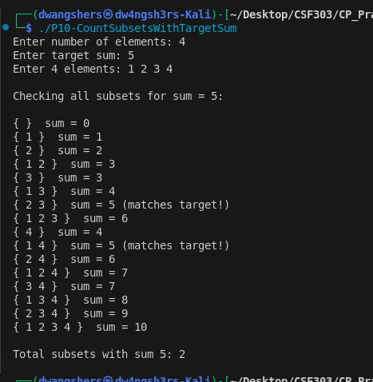

# Problem 10 (Count of Subsets with Sum Equal to Target)

### Problem Summary
Count subsets whose sum equals target.

### Algorithm
Generate all subsets and check sum.

### Time Complexity
O(N * 2^N)

### Space Complexity
O(1)

### Reflection
This problem helped me understand subset sum brute force using bitmasking.

## Screenshot
