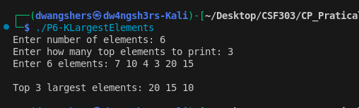

# Problem 6 (K Largest Elements)

### Problem Summary
Find K largest elements using heap.

### Algorithm
Use max heap (priority_queue).

### Time Complexity
O(N log N)

### Space Complexity
O(N)

### Reflection
I learned how heaps are useful for efficiently retrieving top elements.

## Screenshot

