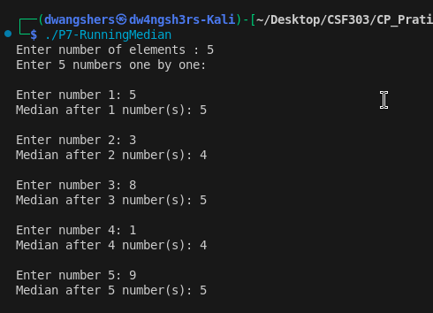

# Problem 7 (Running Median)

### Problem Summary
Find median after each insertion.

### Algorithm
Use two heaps (maxHeap + minHeap).

### Time Complexity
O(N log N)

### Space Complexity
O(N)

### Reflection
This problem helped me understand balancing two heaps for real-time median.

## Screenshot

