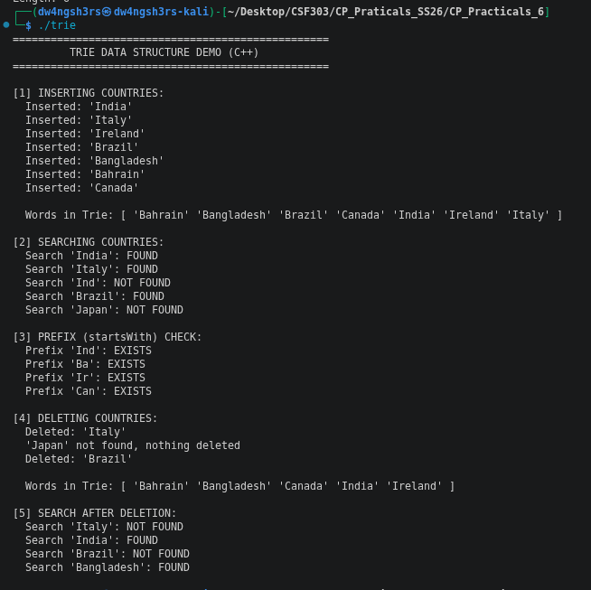
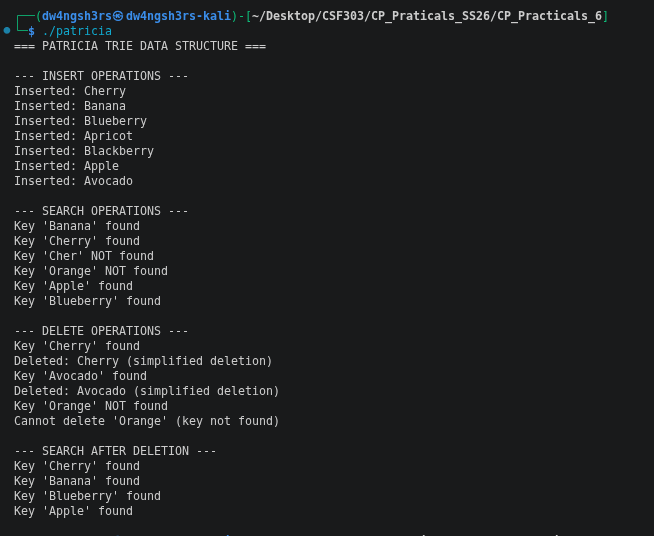
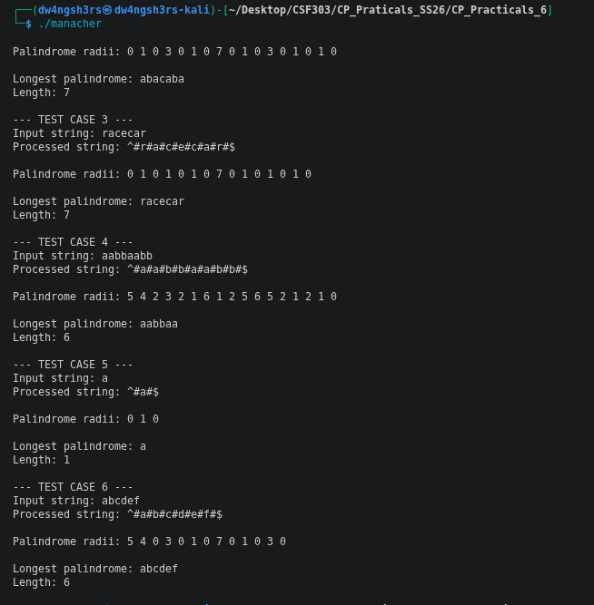

# Practical Reflection: Advanced String Algorithms

## Screenshots

### Trie Algorithm Output

### PATRICIA Algorithm Output

### Manacher's Algorithm Output

---

## Reflection

### What I Learned

Working on these three algorithms was really interesting. At first, I thought they were all similar, but once I started implementing them, I realized they're pretty different in how they actually work.

**Trie** stores words like a tree. Each letter becomes a node, so words that start the same way share nodes. For example, "Apple" and "Apricot" both start with "A", so they use the same first node. Finding a word is easy - just follow the path.

**PATRICIA** is faster than Trie for some cases. Instead of one letter per node, it stores longer pieces of text. It compares bits (0 and 1) to decide which way to go in the tree. This uses less memory and runs quicker because there are fewer nodes to check.

**Manacher's algorithm** finds the longest palindrome in a string quickly. The trick is that it doesn't start from scratch each time - it remembers what it learned before and uses that to skip work. It also adds special characters ("#") between letters so it can handle palindromes of any length the same way.

### Final Thoughts

Each algorithm has its strength. Trie is good when you need to store many words. PATRICIA uses less memory. Manacher's is the best way to find palindromes. 